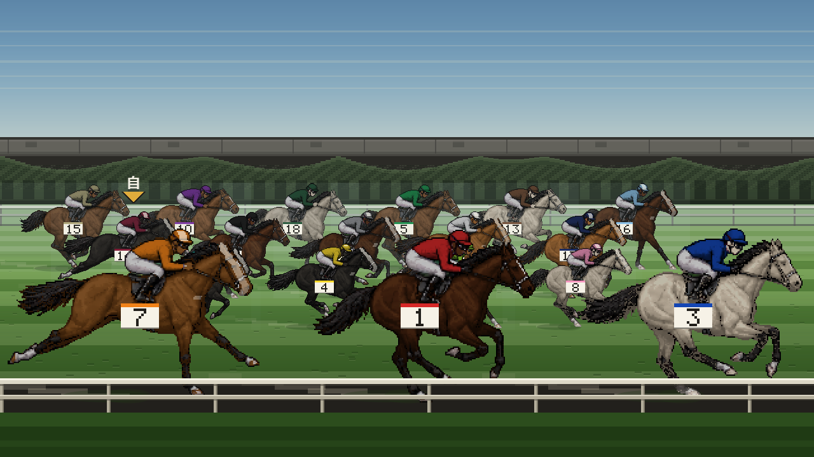
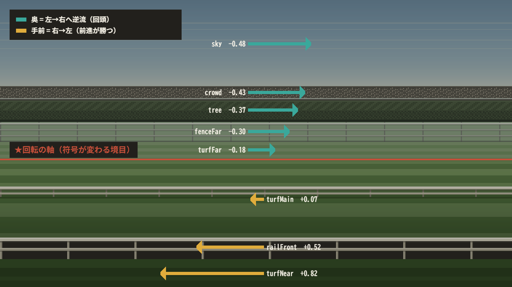

# STAR レース演出素材 — ハンドオフ（第2便）



**今回の範囲**: ★景観3種 → コーナー → 発走（ご指定どおり）。**⑤最終直線・⑥ゴールは第3便**です。

---

## 0. ★最初に読んでいただきたいこと

**§1「スプライトを作り直してください」に対する答えは「作り直さないでください」です。**

計測し直したところ、`horse-gallop-sheet.png`（採用中の良いシート）は
**すでに伸縮しています**。②が 5.6% と出るのは、`bodyLen` が**外接矩形の幅＝尾の先から鼻先まで**で、
**駆歩の尾が常に後方へ流れているため、四肢が畳まれても幅が縮まない**からです。

| 測り方 | 変化 |
|---|---|
| 外形 bbox（現行の ②） | 5.6% ❌ |
| ★**脚先の広がり** | ★**53.5%** ✅ |
| 体高 | 15.6% ✅ |

→ `sprites/measure-gallop.patch.md` に**パッチと新しい基準値**を書きました。
→ そのうえで **8コマ化**（既存6＋新規2）の契約と生成プロンプトを `sprites/` に置いています。

⚠️ `horse-gallop-v2.png` は**背景が透明ではありません**（全面が1つの不透明な塊で、コマの切り出しができません）。
契約と ⑦ を満たしていないので、比較対象として成立していないと考えます。

## 1. 中身

| ファイル | 何か |
|---|---|
| `RESEARCH.md` | ★調べた中継の内容。**出典ありと★推測を分けています**。推測を事実として使わないでください |
| `NOTES.md` | ★判断の理由。**調整するときはここを読んでください** |
| `palette.json` | ★第1便に**マージ**する追記ぶん。既存キーの変更は1つもありません |
| `layers.json` | ★区間ごとの層。**走路（turfFar 以下）は全区間で同一**です（構図を壊さないため） |
| `cuts.md` | ★カット切り替えで何を見せるか。`camera.ts` のカット表に乗せるものだけ |
| `sprites/measure-gallop.patch.md` | ★②の測り方のパッチと新しい基準値 |
| `sprites/contract.md` | ★8コマの契約（並び順・新規2コマの数値・追い出しの差し替え領域） |
| `sprites/prompts/*.md` | ★新規2コマの生成ジョブ（受け入れ条件つき） |
| `scenes/*.png` | 景観3種・コーナー3案・ゲート閉／開・ファンファーレ |
| `scenes/scene.js` | ★参照実装。**still.js（第1便）を書き換えず、上に載せています** |
| `ui/spec.md` | 第2便で足した UI の寸法 |

## 2. 景観3種 — ★「区間で景色が変わる」の実体

| 区間 | 何が違うか |
|---|---|
| ★**向正面** | **観客が1人もいない。** 遠くにスタンドの裏（低く霞んだ灰色 30px）、手前に**外周の樹林**（76px の塊）。★順光なのでグレアなし・霞が弱い（airMul 0.6） |
| ★**3〜4角** | **屋根のない観客**（36px・頭の高さが揃わない）＋**植え込み**（54px・人の手が入っていて天端が揃う）＋**背の高い外柵**（50px）。★走路の中に**2本目のラチ線**（railBend） |
| ★**直線** | **スタンドが正面**。屋根・庇の陰・上段・下段・腰壁の5段（106px）。★逆光全開 |

★**判別できるかは「灰色の帯の高さ」で決まります。** 直線 106px ↔ 向正面 30px ↔ コーナー 36px。
**ここを揃えると3区間が同じに見えます。**

## 3. コーナー — ★本命は「層ごとの速度差」



**線遠近を1本も描かずに「回っている」を出します。**

コーナーではカメラが**向きを変えます**。向きを変えると画面全体が**一律に**横へ流れます
（パン＝距離によらず同じ画素数）。一方、前進による流れは距離ごとに違います（＝第1便の speedRatio）。
★**この2つを足すと、手前は今までどおり右→左、奥は左→右へ逆流します。**

```
sky −0.48 / crowd −0.43 / tree −0.37 / fenceFar −0.30 / turfFar −0.18
   ★符号が変わる境目 = y 400 ← ここが「回転の軸」に見えます
turfMain +0.07 / railBend +0.07 / railFront +0.52 / turfNear +0.82
```

**pan = 0.48 の出どころ**: コーナー 400m ÷ 馬速 17m/s = 23.5秒で 180° → 7.7°/秒。
画角 60°／1280px = 21.3px/度 → 164px/秒。zoom 20px/m の馬速 340px/秒 で割って **0.48**。

★**静止画では直線とほぼ同じに見えます**（＝絵を壊しません）。**動かした瞬間だけ回って見えます。**

| 案 | 判定 |
|---|---|
| a 帯の反り（現行） | ★弱い。静止画で読めず、動かすと「たわんでいる」ように見えます |
| b 内ラチを斜めの帯に | ⚠️ ★§3「線遠近を描き込まない」に抵触。斜めの直線は1本でも遠近を主張します |
| ★**c 回頭** | ★**採用**（`scenes/corner-c.png`） |

## 4. 発走

| 画 | 中身 |
|---|---|
| `scenes/gate-closed.png` | 12房・2×。★**天板の上に騎手の頭**（枠順色）を出しています — これが無いと空のゲートに見えます |
| `scenes/gate-fanfare.png` | ★旗が振られた瞬間。上下から紙の帯が閉じて「間」を作ります |
| `scenes/gate-open.png` | ★**ゲートは馬より後ろ**。扉は房の両脇に折り畳まれ、房の中は地面が透けます |

★**新しいスプライトを1枚も使っていません。** 既存の6コマだけで組んでいます（§6-1）。

## 5. ★守ったこと

- 倍率は 1× と 2× のみ。非整数倍は1か所もありません
- 16進はコードに1つもなく、すべて役割名で引いています
- 背景は水平の帯だけ。★**斜めの線は案 b（比較用）にしかありません**
- 走路の幾何（turfFar 以下・馬の接地線 436/520/626）は**第1便から1px も変えていません**
- 実在の競走馬・馬主・団体・競馬場の名称／ロゴ／勝負服の意匠は使っていません

## 5.5 ★クオリティを上げる回で足したもの

| 軸 | 何をしたか | 画 |
|---|---|---|
| ★毛色の陰影 | **4階調への量子化を撤回**（§6-3 の失敗を私が繰り返していました）。焼き込み後 **7,681色** | 全画 |
| 個体差 | 流星・白斑・毛色のゆらぎを馬IDから決定的に。★**スプライトは増やしていません** | 全画 |
| 芝の質感 | 踏み荒らしの帯＋蹄跡190個＋落ち影を前方へ長く | 全画 |
| 18頭立て | `horsePlan18`（4段）を**追加**。12頭の `horsePlan` は残しています | 全画 |
| 時間帯 | `$daylight`（昼／薄暮／ナイター）。★倍率だけで切り替え | `scenes/light-*.png` |
| 彩度 | ★**P-1 を改訂**。芝・生垣・空を一段上げ、**勝負服とマークは据え置き** | 全画 |

⚠️ ★**体格の差は付けられません**（1× / 2× しかないため）。個体差は色と斑で出しています。

## 6. ★まだ決めていないこと

- **⑤最終直線・⑥ゴール**（第3便）
- **ゴール後に何を何秒映すか** — ★公開情報から特定できませんでした（`RESEARCH.md §6`）
- **枠入りからゲート開放までの秒数** — ★**固定の秒数は存在しません**。実装側の演出で決めてください
- **勝負服の柄** — 第1便から持ち越し（地色18色だけ確定）
