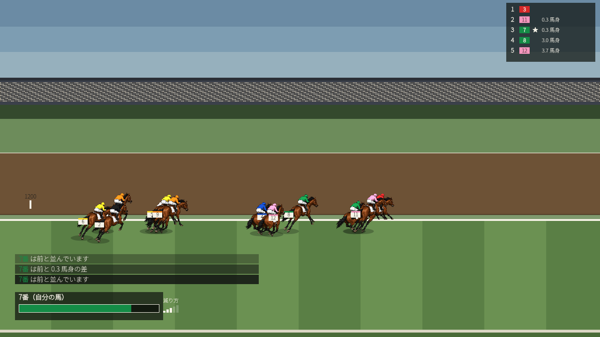
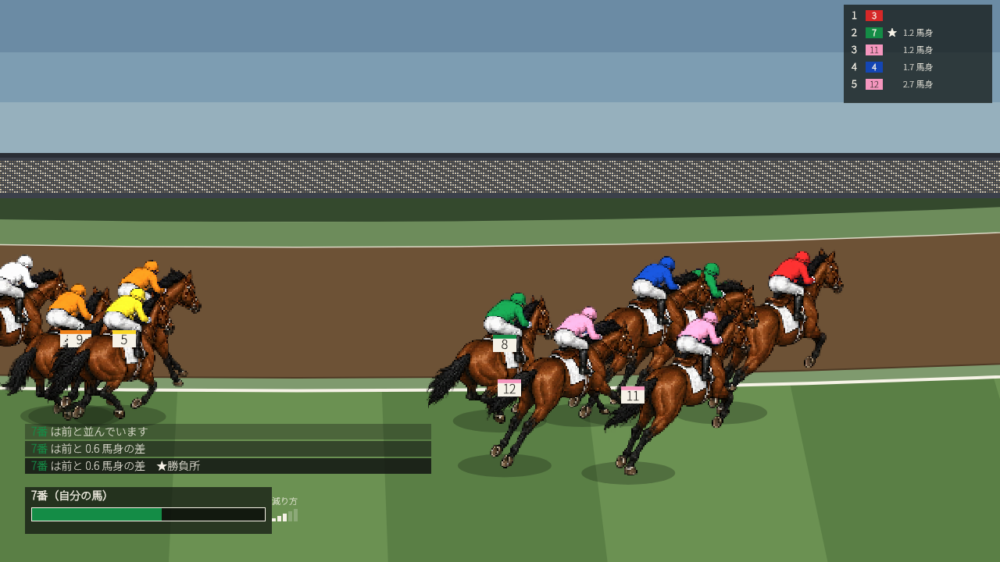
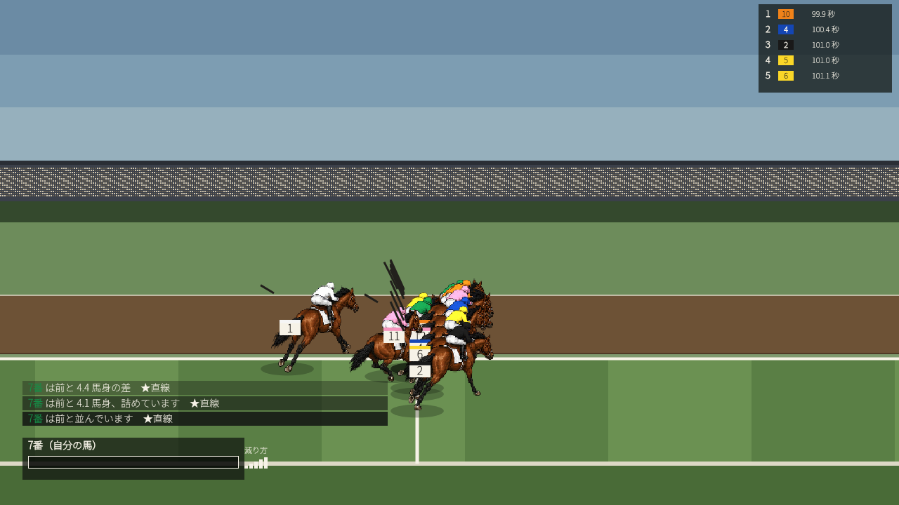
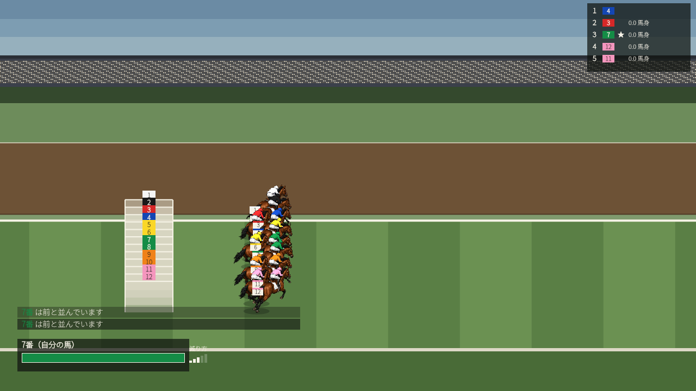
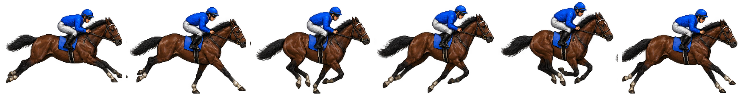
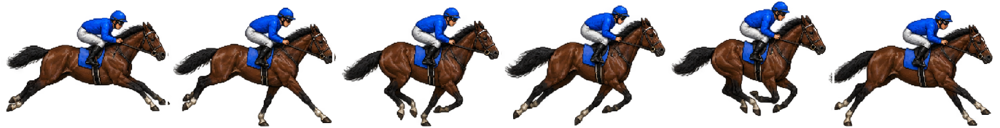

# STAR レース演出素材 — ハンドオフ（第3便）

**今回の範囲**: ★**カットごとの元スプライト（2サイズ）** ／ 騎手の別コマ ／ 発走ゲート ／ 最終直線・ゴール

⚠️ **第2便から状況が変わりました。** 動画が出せるようになり、
**足りないものが「絵を見て」分かりました**。§0 に、その4件を書きます。

### ★いまの画（`now/`）

| | |
|---|---|
|  | ★**引き（道中）** — 馬の幅 120px |
|  | ★**寄り（見せ場）** — 馬の幅 300px |
|  | ★**ゴール** |
|  | ★**発走** — ゲートは**図形で組んでいます**（§3） |

★**これに足りないものを頼んでいます。** 動画は `out/video/race-1600-42.mp4`。

### ★いまの仮スプライト（`sprites/`）

| | |
|---|---|
|  | `horse-gallop-far`（馬 120px）★**仮** |
|  | `horse-gallop-near`（馬 300px）★**仮** |

⚠️ ★**これは第1便のアートを機械で縮めただけ**です（`tools/bake-sprite-sizes.mjs`）。
**寸法の見本**として置いています。★**このまま製品には使いません** —
120px は縮小で脚が潰れ、300px は輪郭が甘くなっています。**そこを描き起こしてください。**

---

## 0. ★何が起きたか（第2便のあと）

斜め俯瞰（β）でレースを **1本まるごと動画に**できるようになりました。
`tools/render-oblique-video.mjs`（本番のエンジン → 境界時刻 → 位置モデル → 投影 → mp4）

★**そこで初めて分かったことが4件**あります。**素材の依頼内容がこれで変わりました。**

| # | 動かして分かったこと | 素材への影響 |
|---|---|---|
| 1 | ★カットで**馬の大きさが 2.4倍**変わる。1枚のシートを縮めると画素の格子が合わない | ★**§1: 元スプライトを2サイズ** |
| 1b | ★引きは**カメラを据える**ことになった（裁定）→ コーナーで**馬の向きが変わる** | ★**§1: `far` は 4向き** |
| 2 | ★直線で騎手が**追う姿**が無い。上体の揺れと鞭で代用したが、**姿勢が変わらない** | ★**§2: 騎手の別コマ** |
| 3 | ★ゴール後に**手を上げる**絵が無い。一番盛り上がる瞬間に何も起きない | ★**§2** |
| 4 | 発走ゲートを**箱として組んだ**が、**絵ではなく図形**。房の質感が無い | ★**§3: ゲート** |

---

## 1. 🔴 カットごとの元スプライト（★最優先）

### なぜ1枚では足りないか

★**2D の参考映像を実測しました**（⚠️ 画の範囲を**機械で決めてから**測定。
前回は**スマホの枠と字幕の黒帯を測って**、測定が全部無効になりました）。

```
★引き   馬の幅 = 画面幅の  9〜11%   → 1280 幅で **119px**
★寄り   馬の幅 = 画面幅の  24%     → 1280 幅で **307px**
★走路の帯 = 画面高の 33%
★画角の幅 = **2.4倍**
```

⚠️ ★**3D の参考（引き 2.7%）は移せませんでした** — ピクセルアートの読める最小（7.5%）を
下回るからです。★**2D を測って初めて、使える数字になりました。**

```
120px → 300px = 2.5倍   ★参考の 2.4倍に一致 → **2枚で足ります**
```

⚠️ ★**焼いたシートから縮めないでください。** 0.909 倍のような半端な比で縮めると
画素の格子が合わず輪郭が濁ります。★**毎回、元のアートから焼き直します。**

### 求めるもの

| 名前 | セル寸法 | ★馬の幅 | 使うカット | 何が読めること |
|---|---|---|---|---|
| `horse-gallop-far` | **124×96** | **120px** | 引き（道中）・馬群 | 体の向き・枠色・腕の上下 |
| `horse-gallop-near` | **304×234** | **300px** | 寄り（見せ場）・ゴール | ＋**鞭・手綱・表情の向き** |

★**2枚です**（当初は3枚と書きましたが、実測で 2枚で足りることが分かりました）。

### 🔴 ★引き（`far`）は **4つの向き**が要ります

★カメラの設計が決まりました（2026-08-16 の裁定）:

```
引き（far）  … ★カメラを**走路に据えます**（数台を切り替える／実際の中継と同じ）
               → 馬がコーナーを回るあいだ、★**画面上で馬の向きが変わります**
寄り（near） … カメラが馬群と一緒に回る → ★向きは**1つ**のまま
```

★**数えました**（`tools/count-headings.mjs`・45°刻み）:

| 距離 | 進行方向が回る量 | カメラ台数 | ★必要な向き |
|---|---|---|---|
| 1200m | 165° | 2台 | 3 |
| 1600m | 180° | 2台 | **4** |
| 2000m | 285° | 3台 | 3 |
| 2400m | 360° | 3台 | **4** |
| 3000m | 465° | 4台 | **4** |
| 3200m | 525° | 6台 | **4** |

→ ★**`far` は 4向き × 8コマ ＝ 32コマ**になります。`near` は 8コマのままです。

| 向き | 何が見えるか |
|---|---|
| **0°**（真横） | 基準。いまあるものと同じ |
| **45°**（斜め手前） | 顔と胸が見える。★奥の脚が隠れる |
| **90°**（正面寄り） | ★**真正面ではありません。**「こちらへ来る」が分かる程度 |
| **−45°**（斜め奥） | 尻と後肢が見える |

⚠️ ★**真後ろ（180°）は要りません。** カメラは走路の外側に据えるので、
   馬が真後ろを向く画角になりません。**描かないでください。**

⚠️ ★**接地点は4向きで一致させてください。** ずれると、向きが切り替わる瞬間に
   **馬が跳ねます**（切り替えは1コマで起きるので、必ず目に付きます）。

★**頭数ぶんではありません。** 毛色5種 × 勝負服の色替えは共通のままなので、
アセット量は倍になるのではなく「**2枚**」で済みます。

### ⚠️ セルの決め方（★一度失敗しています）

★**「最大のコマが収まる縮尺」でセルを決めないでください。**
一度それをやって、**接地点で揃えたときに尾が上下にはみ出し、隣のセルに写り込みました**
（走路に尾が1本だけ浮いて見えました）。

```
セル幅 = ★接地点から左に必要な最大量 ＋ 右に必要な最大量 ＋ 左右 2px
セル高 = ★接地点から上に必要な最大量 ＋ 下に必要な最大量 ＋ 上下 2px
```

★**8コマすべてで測ってから決めます。** 1コマで決めると必ず他がはみ出します。

### 1頭目で確定させること

1. **2枚とも同じ8コマ**（コマの意味がサイズで変わらない）
2. ★**接地点が2枚で一致**（同じ瞬間を並べ、接地点で重ねて確認）
3. ★**far（120px）で脚の動きが読めること**
   ★120px は、こちらで測った「読める最小」96px より上なので、
   ⚠️ **8コマとも潰さずに描けるはず**です。潰れるなら1頭目で言ってください。

---

## 2. 🔴 騎手の別コマ（★動画で足りないと分かったもの）

いまは**姿勢が1つ**しかありません。動画では上体の揺れと鞭で代用していますが、
★**姿勢そのものが変わらない**ので、追っているのか流しているのか読めません。

⚠️ ★**こちらで姿勢を描き足していません。** 無い絵を「あることにしない」ためです。

### 求めるもの（★馬体には一切触りません）

★既存8コマから**騎手＋鞍の画素だけ**を差し替えたシートを、姿勢ごとに1枚。

| 姿勢 | いつ出るか | 何が変わること |
|---|---|---|
| `cruise`（現行） | 道中 | — |
| ★`drive` | **直線（残り400m）** | 背中をさらに低く（頭頂が 6px 下）／手綱を前へ押し出す（8px 前）／★**鞭を右手に持つ** |
| ★`celebrate` | **ゴール後** | ★**手綱から手を離し、片手を上げる**／上体を起こす |

- 差し替える領域: コマ内 **(86, 8) – (168, 74)**（騎手＋鞍の上だけ・220×140 のセル基準）
- ★**勝負服の当て布は動かさないこと**（重心 (133,20) のまま）。動くと色替えが胴からずれます
- 鞭は **コマ0・4 で振り上げ、コマ2・6 で打つ**

⚠️ ★`celebrate` は**寄り（300px）だけで使います**。120px では読めません。
→ ★**`near` サイズだけで結構です。**

---

## 3. 発走ゲート

いまは**図形で組んでいます**（房の長さ 4.0m・高さ 2.6m を投影して箱にする）。
★形は合っていますが、**絵ではありません**（質感・影・扉がない）。

### 求めるもの

| 部品 | 内容 |
|---|---|
| 房1つ（側面） | 仕切りの板・柱・上の桁。★**1房ぶんを1枚**（並べるのはこちらでやります） |
| 前扉（閉） | 発走前 |
| 前扉（開） | ★発走の瞬間、**外側へ開く** |
| 番号板 | ★**無地で結構です**（枠色と馬番はこちらで描きます・D-060） |

- ★寸法の基準: 房の長さ **4.0m** ／ 高さ **2.6m** ／ 仕切りの厚み **0.1m**
- ★**斜め俯瞰で使うので、真横ではなく「少し上から見た側面」**でお願いします
- 背景は透明

---

## 4. 最終直線・ゴール（第2便からの持ち越し）

| 部品 | 内容 |
|---|---|
| 決勝線 | ★走路を横切る白線。**ゴール板**（柱＋鏡）も |
| ハロン棒 | 200m ごと。★数字はこちらで描くので**無地の棒**で結構です |
| 内ラチ・外ラチ | ★**支柱の間隔が分かること**（速度感がここから出ます） |
| 芝の刈り目 | ⚠️ ★**市松にしないでください。** 走路を**端から端まで横切る帯**です（斜めに見えるのは投影の結果） |

---

## 5. ⚠️ こちらが守っていること（変更のお願いではありません）

| | |
|---|---|
| ★実在の競走馬名・レース名・競馬場名 | **使いません**（憲法） |
| ★他社製品の固有名称 | **コードにもコメントにも書きません** |
| 枠色8色＋馬番 | ★業界共通の作法として採用（D-060） |
| 色 | `palette.json` の範囲内。★**新しい色を足さないでください** |

---

## 6. ⚠️ ★保留にしている数字

★**2026-08-16 に 2D の参考を測って、確定しました。**

| | 参考（2D・実測） | 直す前のこちら | ★入れた値 |
|---|---|---|---|
| 引きの馬の幅 | **9〜11%** | 5.0%（64px） | ★**120px（9.4%）** |
| 寄りの馬の幅 | **24%** | 14.1%（180px） | ★**300px（23.4%）** |
| 走路の帯 | **33%** | 23% | ★**33%** |

### ⚠️ ★**割合をそのまま移さなかったもの**（理由付き）

| | 参考 | こちら | なぜ移さないか |
|---|---|---|---|
| 実況帯の高さ | **25%** | 9% | ★参考の画は **296px 幅**です。小さい画面で読ませるために帯が大きい。**1280 で 25% は大きすぎます**（帯だけで 180px） |
| ★**走路の向き** | **画面を斜めに横切る** | ほぼ水平 | ★**設計が違います**（下の 🔴） |

### ✅ 走路の向き — **裁定が出ました**（2026-08-16）

```
引き … ★カメラを**走路に据える**（参考と同じ。走路が画面を斜めに横切る）
       → 「カメラを馬群と一緒に回すと、走路が水平のまま流れて
          **ランニングマシンに見える**」
寄り … カメラが馬群と一緒に回る（中継の見え方を残す）
```

→ ★**素材への影響が §1 の「4向き」**です。

---

## 7. 添える資料

★**このフォルダだけで完結します**（外を参照しません）。

| ファイル | |
|---|---|
| `now/race.mp4` | ★**いまの動画**（これに足りないものを頼んでいます） |
| `now/*.png` | 引き・寄り・ゴール・発走の静止画 |
| `sprites/*.png` | ★仮の元スプライト（**寸法の見本**。製品には使いません） |
| `docs/sheet-contract.md` | ★シート契約（§5 にカットごとの寸法） |
| `docs/art-bible.md` | アートバイブル（カットの3系統） |
| `docs/RACE_PRESENTATION_BASICS.md` | ★**レース演出の作り方**（実測の根拠が集まっています） |
| `docs/OBLIQUE_CONTRACT_20260815.md` | 斜め俯瞰の契約 |
| `docs/palette.json` | ★**使える色**（新しい色を足さないでください） |

---

## 8. ⚠️ ★お願いの優先順位

**先に着手されるなら、この順でお願いします。**

| # | | なぜ |
|---|---|---|
| 1 | ★`near`（馬 300px・8コマ） | ★**寸法が確定しています**（実測済み・向きも1つ） |
| 2 | ★騎手の別コマ（`drive` / `celebrate`・near のみ） | ★一番盛り上がる場面に**絵が無い** |
| 3 | `far`（馬 120px・**4向き × 8コマ**） | 量が多いので、1向き目で**接地点の合わせ方**を確認してから |
| 4 | 発走ゲート | いまは図形で代用できています |
| 5 | 決勝線・ハロン棒・ラチ・芝目 | 同上 |
